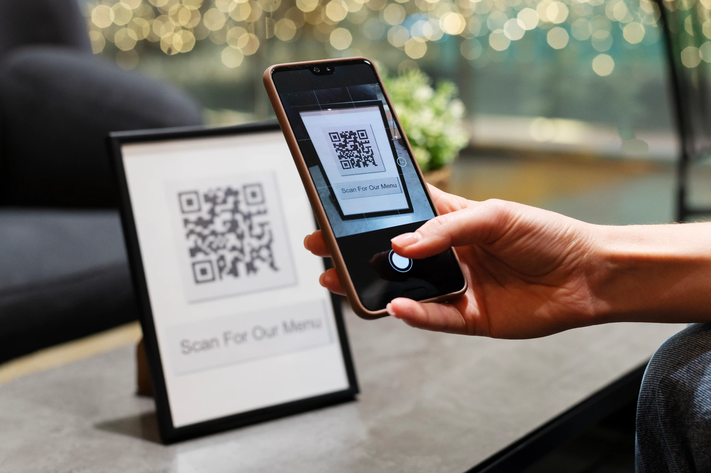

# Menu-GO (Dineqrs)

[](https://nextjs.org)
[](https://react.dev)
[](https://www.prisma.io)
[](https://www.typescriptlang.org)
[](https://tailwindcss.com)
[](https://turbo.build)
[](https://pnpm.io)

QR-based digital menu management SaaS for restaurants. Restaurants create menus, generate QR codes, and customers scan to view the menu in the browser. Built as a Next.js 16 full-stack monorepo.

## Screenshots

<p align="center">
  
</p>

> Drop additional captures under `apps/menu-go/public/images/` and reference them here (panel, public menu, QR flow).

## Stack

- **Framework:** Next.js 16 (Pages Router + App Router hybrid), React 19
- **Auth:** NextAuth.js 4 (Google, Facebook, Credentials) with Prisma adapter
- **Database:** PostgreSQL via Prisma 7
- **Storage:** Vercel Blob (dish images), base64 in DB (QR codes — see `IMPROVEMENTS.md`)
- **AI:** Anthropic Claude for photo menu parsing
- **Tooling:** Turborepo 2, pnpm workspaces, Jest 30, ESLint, Tailwind 4, TypeScript 6
- **i18n:** `next-i18next` (translations under `public/locales/`)

## Requirements

- Node.js >= 20
- pnpm 8.15.4 (see `packageManager` in `package.json`)
- Docker + Docker Compose (for local Postgres)
- Prisma >= 7

## Monorepo Layout

```
menu-go-frontend/
├── apps/menu-go/          # Main Next.js 15 app
├── packages/
│   ├── db/                # Prisma schema + shared client
│   ├── ui/                # Shared React UI components (Rollup)
│   ├── config/            # Shared Next.js, ESLint, Jest configs
│   ├── tsconfig/          # Shared TypeScript configs
│   └── tailwind-config/   # Shared Tailwind config
```

Path alias `@/*` → `apps/menu-go/src/*`.

## Setup

### 1. Clone

```bash
git clone git@github.com:pretxel/menu-go.git
cd menu-go
```

### 2. Install deps

```bash
pnpm install
```

### 3. Configure env

Copy `.env.example` → `.env`, fill values:

```
DATABASE_URL=             # Postgres connection string (Supabase pooled URL, port 6543)
DIRECT_URL=               # Prisma CLI connection (Supabase session pooler, port 5432); optional with Docker
GOOGLE_CLIENT_ID=
GOOGLE_CLIENT_SECRET=
FACEBOOK_CLIENT_ID=
FACEBOOK_CLIENT_SECRET=
EMAIL_SERVER=             # SMTP for email auth
EMAIL_FROM=
SECRET=                   # NextAuth secret
NEXT_PUBLIC_SITE_URL=     # Used for QR code URLs
ANTHROPIC_API_KEY=        # Photo menu parsing
OPENAI_API_KEY=
```

### 4. Database

**Supabase (primary).** The project uses a Supabase Postgres (project `menu-go`, region `eu-west-1`). Set `DATABASE_URL` to the Supavisor transaction pooler (port 6543) and `DIRECT_URL` to the session pooler (port 5432). Note: free-tier projects pause after ~1 week of inactivity — resume from the Supabase dashboard.

**Docker (local fallback).**

```bash
docker compose up -d
```

Local Postgres runs on `:5432` with `postgres:secrect` (intentional typo retained from original config). With Docker, point `DATABASE_URL` at it and omit `DIRECT_URL`.

### 5. Push schema + seed

```bash
pnpm db:push
pnpm db:seed
```

### 6. Run dev server

```bash
pnpm dev
```

App at <http://localhost:3000>.

## Scripts

| Command | Purpose |
|---------|---------|
| `pnpm dev` | Dev server (loads `.env`) |
| `pnpm build` | Production build |
| `pnpm start` | Run built app |
| `pnpm lint` / `pnpm lint:fix` | ESLint check / auto-fix |
| `pnpm test` | Jest across all packages |
| `pnpm format` | Prettier on `**/*.{ts,tsx,md}` |
| `pnpm db:generate` | Generate Prisma client |
| `pnpm db:push` | Push schema + regenerate client |
| `pnpm db:seed` | Seed database |
| `pnpm db:reset` | Reset database |
| `pnpm db:migrate` / `db:migrate:dev` | Run migrations |
| `pnpm clean` | Clean Turbo outputs |

Run a single Jest file:

```bash
cd apps/menu-go && pnpm test -- --testPathPattern=<filename>
```

## Architecture

### Routing (Hybrid)

- **Pages Router** (`src/pages/`): Public — `/`, `/login`, `/learn`, `/privacy`
- **App Router** (`src/app/`): Protected panel + APIs — `/panel/**`, `/menu/[restaurantId]`, `/api/**`

`src/middleware.ts` guards `/panel` routes via `next-auth.session-token` cookie.

### Auth

`src/lib/auth.ts` — NextAuth with Google, Facebook, Credentials providers. Prisma adapter persists users/sessions. Session callback enriches session with `configRestaurantId`. JWT strategy.

### Data Layer

Prisma client in `packages/db/`. Import: `import { prisma } from 'db'`. Models:

- `User` — auth user + linked OAuth accounts
- `ConfigRestaurant` — restaurant profile (name, address, phone, image, QR base64)
- `Dishes` — menu items linked to restaurant + category
- `Category` — globally shared (no per-restaurant isolation; tracked in `IMPROVEMENTS.md`)

### Mutations

Writes go through Server Actions in `src/app/actions.ts`:

- `postDish()` — create/update dish (FormData)
- `postRestaurant()` — create/update restaurant + generate QR
- `updateDish()` — update dish image via Vercel Blob

## Further Docs

- [`CLAUDE.md`](./CLAUDE.md) — guidance for Claude Code
- [`DEFINITION.md`](./DEFINITION.md) — product/feature definitions
- [`IMPROVEMENTS.md`](./IMPROVEMENTS.md) — known issues + tech debt
- [`NEXTJS15_MIGRATION.md`](./NEXTJS15_MIGRATION.md) — Next.js 15 migration notes
- [`UPGRADE_SUMMARY.md`](./UPGRADE_SUMMARY.md) — upgrade history
